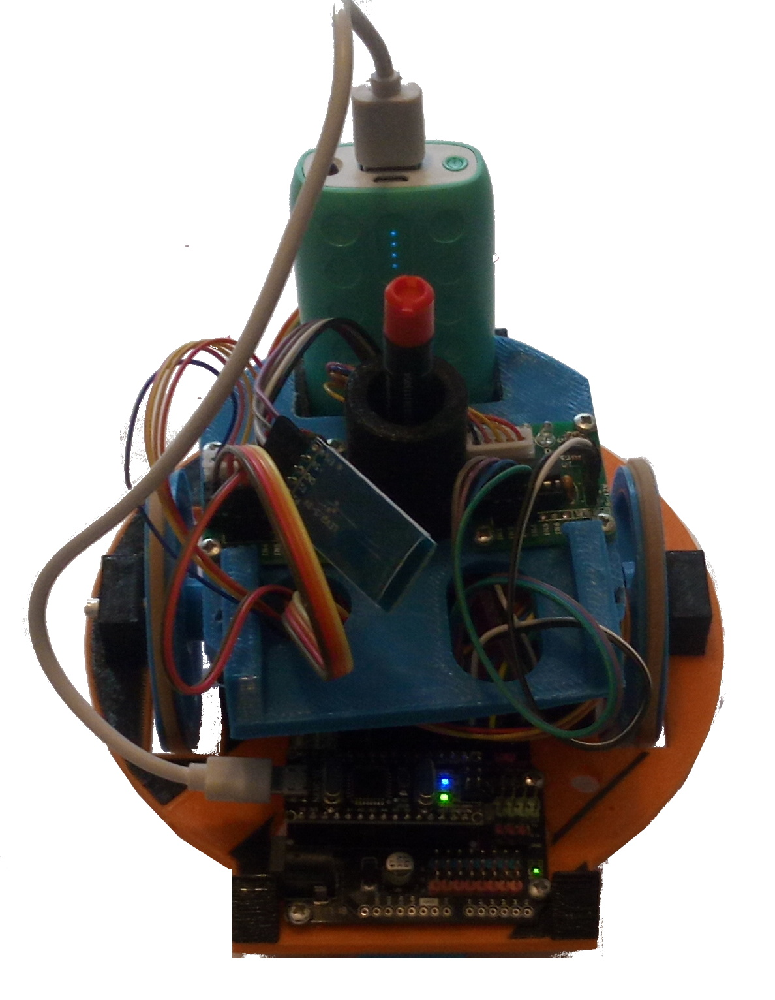

# Breizhbot

Breizhbot est un robot qui dessine des formes géométriques.
Il s'inspire du projet OpenSource d'Orange OoRoBoT : https://github.com/Orange-OpenSource/oorobot/

## Présentation
[Vidéo de présentation : Dessiner la mettre 'P' avec la breizhbot](http://www.youtube.com/watch?v=XUItwnMhHWA&feature=youtu.be)

{:width="360px"}

## Fonctionnement

(En cours de rédaction)